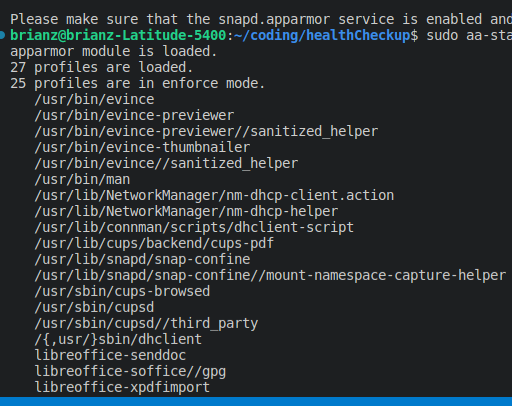

# File Structure

```
Health Monitor Application
 - Backend web API built in Springboot framework
 - Frontend UI built in React
```

## Makefile Notes

```
Trying to stop containers Cases

1.) Permission Denied - this is often the result of apparmor blocking the removal of containers.

- Run "Make stop-appArmor" in a new terminal
    ** sudo aa-status show now show something similar to the screenshot below this section


    - Run "docker ps" to find any remaining containers
    - Run "docker rm <CONTAINER ID>" *The container ID should show from the step above
    - Once the docker image is removed, run "docker stop <CONTAINER NAME>" *Also from "docker   ps" (container name may not be showing if the image is already removed so you will need to look back at the previous logs to find the container name to remove)
- Run "Make restart-appArmor"
```


